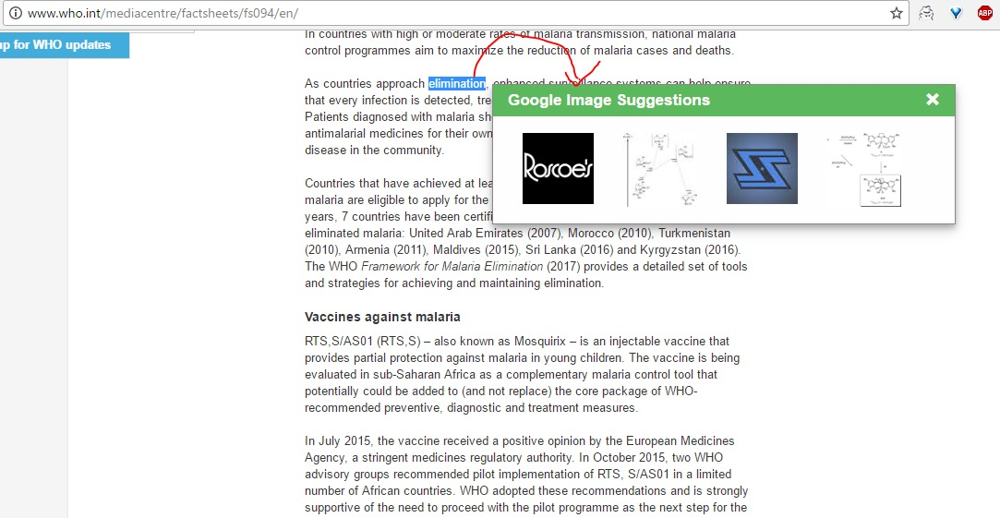

# Chrome Extension

> With this extension, you can:

-  Double-click any word to view its images from google images.

## Demo

## Set up Google Custom Search Engine

Google deprecated their public Google Images API, so to search for images you need to sign up for Google Custom Search Engine.
Here are the steps you need to do:

### 1. Create a Google Custom Search Engine

You can do this here: [https://cse.google.com/cse](https://cse.google.com/cse).

Do not specify any sites to search but instead use the "Restrict Pages using Schema.org Types" under the "Advanced options".
For the most inclusive set, use the Schema: `Thing`. Make a note of the CSE ID.

### 2. Enable Image Search

In your search engine settings, enable "Image search":

### 3. Set up a Google Custom Search Engine API

Register a new app and enable Google Custom Search Engine API here: [Google Developers Console](https://console.developers.google.com).
Make a note of the API key.